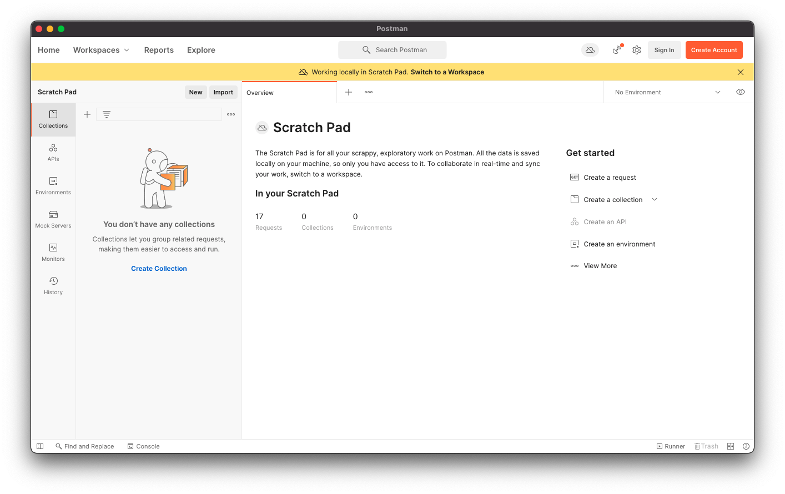
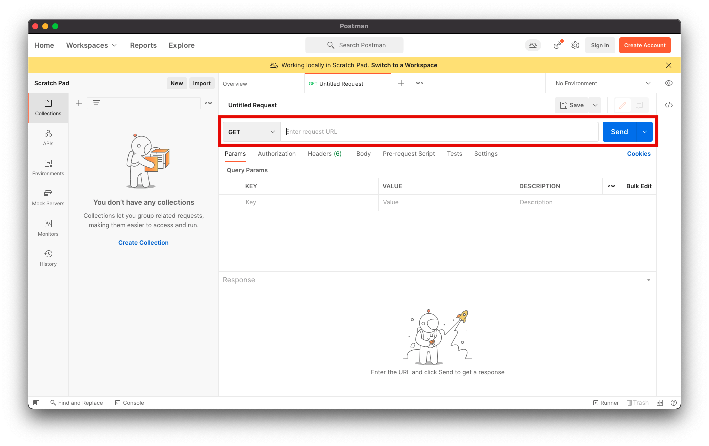

# Request parameters

Learn to send `GET` and `POST` HTTP requests with parameters using a graphical interface.

## Postman

In this section you'll learn how to use the program Postman, which is also a **web client** like `curl`, but with a graphical interface, which is a bit easier to use and configure.

[Go to this page to install Postman on your machine.](https://www.postman.com/downloads/)

Drag the Postman program in your Applications directory if you're on Mac, or follow the installation instructions if you have a different system.

On the first launch, Postman should welcome you with the following screen.



Just like `curl`, we can use Postman to send HTTP requests to web servers, and use it to inspect the responses we receive.

Click on the `+` icon next to the "Overview" tab to open a new tab.

There are quite a few different options to configure the request we want to send, but the more important part (circled in red on the screenshot below) is where you set the **request method** and the **URL**.



Leave the method set to `GET` and paste the URL `https://jsonplaceholder.typicode.com/todos/1`, then click the "Send" button.

You should get the JSON response in the bottom panel of the program:


We can see two important aspects of this response:
* its content (the JSON data).
* its status code (`200 OK` - on the top-left corner of the panel).

The web server decides which status code to assign to the response, as a way of communicating to the client whether everything is fine (`200` - "OK"), or if something wrong happened. [A lot of different status codes](https://developer.mozilla.org/en-US/docs/Web/HTTP/Status) exist for different situations. A famous one you probably already know of is `404` ("Not Found"), used by the server to indicate that the server cannot respond to a request.

In the following exercises, you'll practice by sending requests to the Postman Echo website, which returns some pre-defined responses to some requests. You'll learn about some components of GET and POST requests.

## `GET`, `POST` and Parameters

* The `GET` method is often used to _query or retrieve_ information from the server. The exact data returned depends of the implementation of the web server.   
  A `GET` request can also contain _query parameters_.

* The `POST` method is often used to _send_ data to the web server (usually to create or update data, or just send some information). What is done with this data depends of the implementation of the web server.  

  A `POST` request can also contain _body parameters_. Contrarily to _query_ parameters, they are not included in the URL, but within the request body itself.

## Demonstration

@TODO

## Exercise One

Use Postman to send a `GET` request to the URL `https://postman-echo.com/get`. In the "Query params" section, set a query parameter with key `title` and value `'Hello'`. Then send the request.

You should get the following JSON response, and the status code should be `200 OK`:

```json
{
    "args": {
        "title": "Welcome",
        "content": "Oh hi"
    },
    "headers": {
        // (omitted).
    },
    "url": "https://postman-echo.com/get?title=Welcome&content=Oh%20hi"
}
```

_You'll note that Postman automatically added the parameters at the end of the URL, using a syntax such as `?title=Welcome&content=Oh hi` — this is the way query parameters are sent in `GET` requests, inside the URL itself._

## Exercise Two

Use Postman to send a `POST` request to the URL `https://postman-echo.com/post`.In the "Body" tab below the URL field, select the option "form-data", and set a parameter with key `title` and value `'Hello'`. Then send the request.

You should get the following JSON response, and the status code should be `200 OK`:

```json
{
    "args": {},
    "data": {},
    "files": {},
    "form": {
        "title": "Hello"
    },
    "headers": {
        // (omitted).
    },
    "json": null,
    "url": "https://postman-echo.com/post"
}
```

## It depends on the implementation

It's important to remember that what is done with the data sent by the client (is it saved? is it even used?), and what response is returned to the client (content and status code) is **all dependent on the web server code**.

Sending a `POST` request doesn't guarantee the sent data will be saved correctly, if the implementation on the server side isn't doing what it should.  

It's important to remember that it will be up to you, the web server developer, to implement and configure your web server correctly so the requests are correctly handled to implement your program behaviour.

<!-- BEGIN GENERATED SECTION DO NOT EDIT -->

---

**How was this resource?**  
[😫](https://airtable.com/shrUJ3t7KLMqVRFKR?prefill_Repository=makersacademy/web-applications&prefill_File=http_bites/03_request_parameters.md&prefill_Sentiment=😫) [😕](https://airtable.com/shrUJ3t7KLMqVRFKR?prefill_Repository=makersacademy/web-applications&prefill_File=http_bites/03_request_parameters.md&prefill_Sentiment=😕) [😐](https://airtable.com/shrUJ3t7KLMqVRFKR?prefill_Repository=makersacademy/web-applications&prefill_File=http_bites/03_request_parameters.md&prefill_Sentiment=😐) [🙂](https://airtable.com/shrUJ3t7KLMqVRFKR?prefill_Repository=makersacademy/web-applications&prefill_File=http_bites/03_request_parameters.md&prefill_Sentiment=🙂) [😀](https://airtable.com/shrUJ3t7KLMqVRFKR?prefill_Repository=makersacademy/web-applications&prefill_File=http_bites/03_request_parameters.md&prefill_Sentiment=😀)  
Click an emoji to tell us.

<!-- END GENERATED SECTION DO NOT EDIT -->
